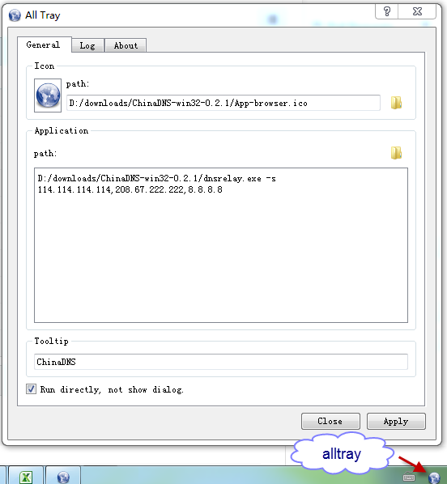
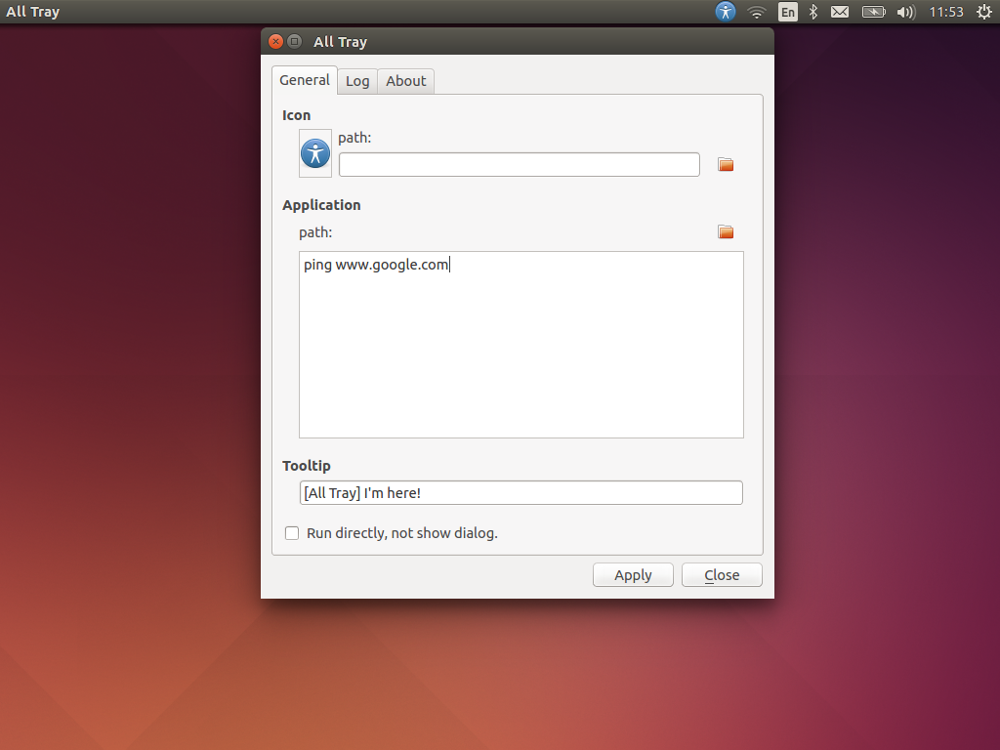

AllTray
=========
Make a System Tray Icon for all application.

Install
-------
Simple Install with pip::

    pip install alltray --user

From source::

    python setup.py install

Usage
-----
::

    $ alltray --help

    usage: alltray.py [-h] [--config CONFIG] [--tooltip TOOLTIP] [--icon ICON]
                      [command]

    positional arguments:
      command            To run command

    optional arguments:
      -h, --help         show this help message and exit
      --config CONFIG    command group
      --tooltip TOOLTIP  tray tool tip
      --icon ICON        command icon

example::

    alltray --config chinadns

Pack execute or app file
-------------------------
For window, use cx_Freeze_
For mac os x, still has some issue...

cx_Freeze
~~~~~~~~~
::

    python cx_Freeze_setup.py bdist

pyinstaller
~~~~~~~~~~~

1. install pywin32 from http://sourceforge.net/projects/pywin32/files/
2. pip install pyinstaller
3. [option] install upx from http://upx.sourceforge.net/
4. Run ``pyinstaller --clean -i Apps-wheelchair.icns -w alltray.py``

Execute file will be found in "dist" directory.

.. important::

    + The execute file only be exectuted in ASCII directory. No support other encoding directory. It just is pyinstaller bug.
    + The single execute file could not be run in window 64bit! bug!

py2exe
~~~~~~~
too old, please ignore it.
::

    python py2exe_setup.py py2exe

Icon
-----
http://www.iconarchive.com/show/nuoveXT-2-icons-by-saki/Apps-wheelchair-icon.html

Screenshot
----------
+ Window

+ Ubuntu

